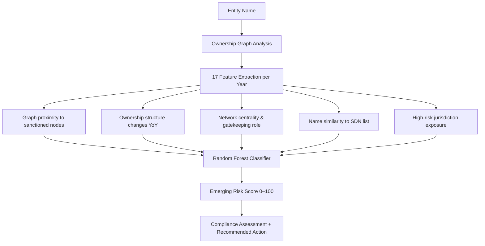

# Temporal Risk Prediction

> *"We moved sanctions compliance from reactive to predictive — from 'is this person on a list' to 'is this person heading toward a list.'"*

Sanctions lists are always one step behind. By the time a name appears on OFAC's SDN list, the damage is done — money has moved, relationships exist, exposure is real.

This system predicts **which entities are exhibiting pre-sanction behavioral patterns** before any official designation occurs, giving compliance teams time to act rather than react.

---

## How it works



The model is trained on 11 years of ownership graph data (2016–2026) across 1,500 entities. The key insight baked into the training data: **entities that become sanctioned start acquiring ownership connections to already-sanctioned entities 1–2 years before their designation.** The model learns to recognize this pattern.

---

## Risk levels

| Score | Level | Recommended Action |
|-------|-------|--------------------|
| 0–14 | **LOW** | No action. Standard monitoring. |
| 15–34 | **ELEVATED** | Flag for quarterly review. Monitor trend. |
| 35–59 | **HIGH** | Escalate to compliance officer. Enhanced due diligence. |
| 60–79 | **VERY HIGH** | Senior review. Consider transaction restrictions. |
| 80–100 | **CRITICAL** | Block immediately. Escalate. Regulatory notification may apply. |

---

## What drives the score (17 features)

| Category | Features |
|----------|----------|
| **Sanctions proximity** | Distance to nearest sanctioned entity, direct sanctioned connections, paths through sanctioned network, propagated network risk |
| **Ownership dynamics** | Changes in ownership last year, new connections acquired, portfolio growth rate, restructuring intensity |
| **Network structure** | Betweenness centrality, total ownership links, companies controlled, ownership chain depth |
| **Identity signals** | Name similarity to SDN list, number of aliases |
| **Jurisdiction** | High-risk country association (FATF blacklist / OFAC country programs) |

---

## Setup

```bash
# Backend
pip install -r requirements.txt
uvicorn api:app --reload --port 8000
```

First start trains the Random Forest model (~30–60 seconds) and pre-scores the watchlist. Both are cached — subsequent starts are instant.

```bash
# Frontend
cd frontend
npm install
npm run dev      # → http://localhost:5173
```

---

## API

### `POST /temporal/analyze`
Search for an entity by name and return full risk profile.

```json
{ "entity_name": "Vladimir Petrov", "top_k": 5 }
```

Response includes: `risk_score`, `risk_level`, `reasons`, `history` (year-by-year scores), `feature_breakdown` (all 17 features with business descriptions), `blacklisted_neighbors`, `search_candidates`.

### `GET /temporal/watchlist?limit=50&view=top`

Returns ranked list of non-sanctioned entities with elevated risk. `view` options:

| View | Description |
|------|-------------|
| `top` | Highest current risk score |
| `rising` | Biggest year-over-year increase — early warning signal |
| `critical_edge` | Score 60–79 — next in line for escalation |
| `declining` | Biggest year-over-year decrease |
| `name` | Alphabetical |

### `GET /temporal/search?q=ivanov&top_k=10`
Fuzzy name search (Jaro-Winkler, threshold 0.55).

### `GET /health`
```json
{ "status": "ok", "entities": 1500 }
```

---

## What makes this different

Existing compliance tools (Refinitiv World-Check, Chainalysis, TRM Labs) answer one question: *"Is this entity sanctioned right now?"*

This system answers a different question: *"Is this entity behaving like entities that get sanctioned?"*

That's the shift from reactive screening to predictive intelligence.
