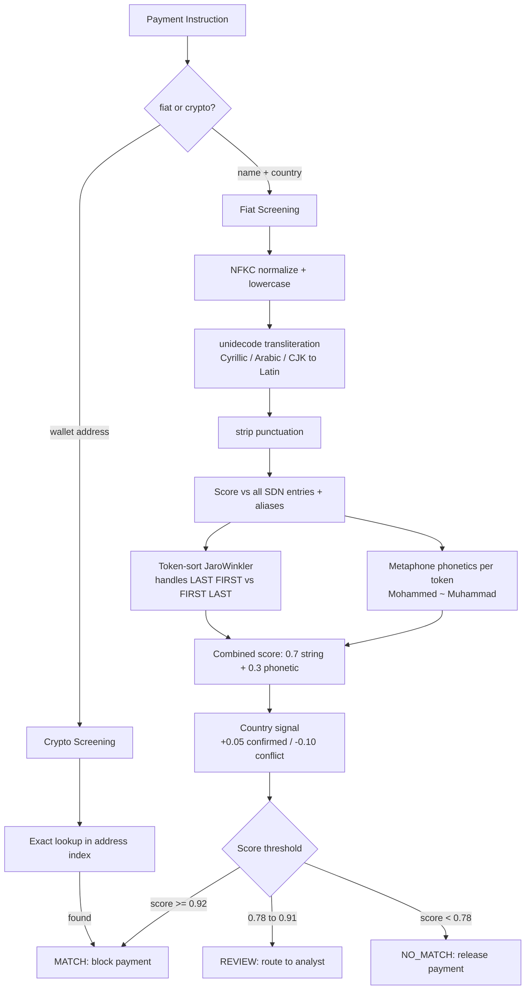

# Sanctions Screener

Screen payment instructions against the OFAC SDN list.
Returns one of three verdicts: **MATCH**, **REVIEW**, or **NO_MATCH**.

## Architecture



## Data source

OFAC Specially Designated Nationals (SDN) list — public domain, updated daily.
Downloaded automatically on first startup and cached to `.cache/sdn.xml`.

- ~12,000 designated entities
- Includes all aliases (a.k.a. / f.k.a.)
- Includes sanctioned cryptocurrency addresses (BTC, ETH, XMR, USDT, etc.)

## Setup

```bash
pip install -r requirements.txt
uvicorn api:app --reload
```

On first start the SDN XML (~30 MB) is downloaded. Subsequent starts use the cache.

## API

### `POST /screen`

```json
// Fiat transfer
{
  "name": "Sergei Ivanov",
  "country": "Russia"
}

// Crypto transfer
{
  "wallet_address": "1FzWLkAahHooV3kzTgyx6qsswXJ6sCXkSR"
}
```

Response:

```json
{
  "verdict": "MATCH",
  "score": 0.97,
  "matched_entity": "IVANOV, Sergei Borisovich",
  "matched_alias": "IVANOV, Sergei",
  "programs": ["UKRAINE-EO13661"],
  "country_signal": "confirmed",
  "reason": "High-confidence hit: ...",
  "top_candidates": [...]
}
```

### `GET /health`

```json
{"status": "ok", "entities": 12483, "crypto_addresses": 847}
```

## Verdict logic

| Score | Verdict | Action |
|-------|---------|--------|
| ≥ 0.92 | **MATCH** | Block payment automatically |
| 0.78 – 0.91 | **REVIEW** | Route to human analyst |
| < 0.78 | **NO_MATCH** | Release payment |

Country signal adjusts the name score: **+0.05** on country match, **−0.10** on country conflict.
This means a near-perfect name match in the wrong country can be pushed down to REVIEW instead of MATCH.

## Name matching examples

| Input | SDN alias | Score | Verdict |
|-------|-----------|-------|---------|
| Sergei Ivanov | IVANOV Sergei | 1.00 | MATCH |
| Sergey Ivanov | IVANOV Sergei | ~0.95 | MATCH |
| Сергей Иванов | IVANOV Sergei | ~0.93 | MATCH |
| Mohammed Al-Rashid | MOHAMMAD AL RASHID | ~0.89 | MATCH |
| Muhammad Al Rashid | MOHAMMAD AL RASHID | ~0.91 | MATCH |
| Xi Jinping | XI Jinping | ~0.98 | MATCH |
| John Smith | — | ~0.55 | NO_MATCH |

## Limitations

- SDN only: does not include EU Consolidated List, UN List, or HMT (UK) list.
  These are parseable in the same pattern and can be added as additional loaders.
- Crypto screening is exact-match only. Indirect exposure (funds routed through
  sanctioned addresses) requires a blockchain analytics provider (Chainalysis, TRM).
- Transliteration via `unidecode` is lossy. Arabic → Latin is approximate; errors
  are partially compensated by the Metaphone phonetic layer.
- Thresholds (0.92 / 0.78) are starting points. Calibrate on your own labeled data.
